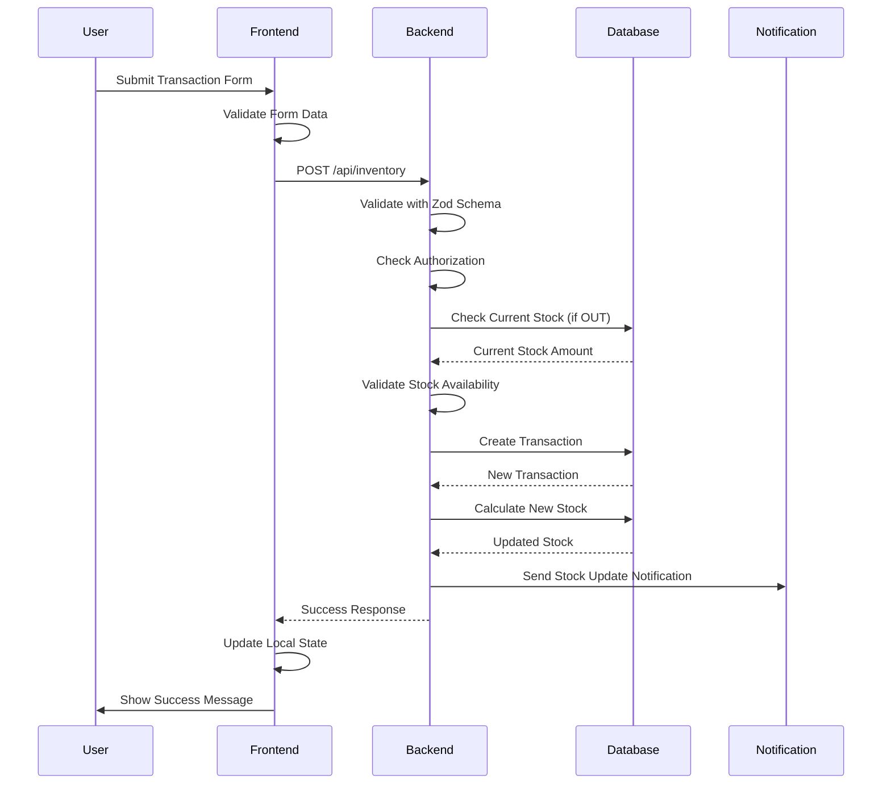
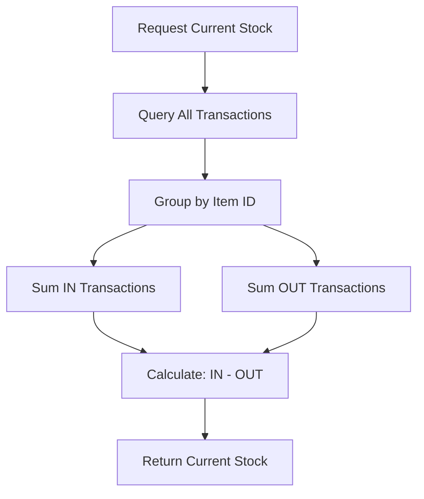

# معماری فنی مدیریت موجودی
# Inventory Management Technical Architecture

## نمای کلی معماری (Architecture Overview)

سیستم مدیریت موجودی بر اساس معماری ۳ لایه طراحی شده است:

```
┌─────────────────────────────────────────┐
│           Frontend Layer                │
│  (React + TypeScript + Tailwind)       │
├─────────────────────────────────────────┤
│            Backend Layer                │
│  (Node.js + Express + TypeScript)      │
├─────────────────────────────────────────┤
│           Database Layer                │
│         (PostgreSQL + Prisma)          │
└─────────────────────────────────────────┘
```

## لایه دیتابیس (Database Layer)

### مدل‌های داده (Data Models)

#### 1. جدول `Item` (کالاها)
```sql
Table Item {
  id               String    [pk, uuid]
  name             String    [not null]
  category         String    [not null]
  unit             String    [not null] // واحد اندازه‌گیری
  minStock         Float?    [null]     // حداقل موجودی
  description      String?   [null]
  barcode          String?   [null]
  image            String?   [null]     // URL تصویر
  isActive         Boolean   [default: true]
  createdAt        DateTime  [default: now()]
  updatedAt        DateTime  [updatedAt]
  
  // Relations
  inventoryEntries InventoryEntry[]
  suppliers        ItemSupplier[]
  scanHistory      ScanHistory[]
}

Indexes:
- [category] : برای فیلتر دسته‌بندی
- [name]     : برای جستجو
- [barcode]  : برای اسکنر
```

#### 2. جدول `InventoryEntry` (تراکنش‌های موجودی)
```sql
Table InventoryEntry {
  id           String             [pk, uuid]
  itemId       String             [fk -> Item.id]
  quantity     Float              [not null]
  type         InventoryEntryType [not null] // IN | OUT
  note         String?            [null]
  unitPrice    Float?             [null]     // قیمت واحد
  batchNumber  String?            [null]     // شماره دسته
  expiryDate   DateTime?          [null]     // تاریخ انقضا
  userId       String             [fk -> User.id]
  createdAt    DateTime           [default: now()]
  updatedAt    DateTime           [updatedAt]
  
  // Relations
  item         Item
  user         User
}

Indexes:
- [itemId, type] : برای محاسبات موجودی
- [createdAt]    : برای مرتب‌سازی زمانی
```

#### 3. جدول `Supplier` (تأمین‌کنندگان)
```sql
Table Supplier {
  id           String      [pk, uuid]
  name         String      [not null]
  contactName  String?     [null]
  email        String?     [null]
  phoneNumber  String?     [null]
  address      String?     [null]
  notes        String?     [null]
  isActive     Boolean     [default: true]
  createdAt    DateTime    [default: now()]
  updatedAt    DateTime    [updatedAt]
  
  // Relations
  items        ItemSupplier[]
}
```

#### 4. جدول `ItemSupplier` (رابطه کالا-تأمین‌کننده)
```sql
Table ItemSupplier {
  itemId           String   [fk -> Item.id]
  supplierId       String   [fk -> Supplier.id]
  preferredSupplier Boolean [default: false]
  unitPrice        Float?   [null]
  createdAt        DateTime [default: now()]
  updatedAt        DateTime [updatedAt]
  
  // Composite Primary Key
  @@id([itemId, supplierId])
}
```

### محاسبات دیتابیس (Database Calculations)

#### محاسبه موجودی فعلی:
```sql
SELECT 
  SUM(CASE WHEN type = 'IN' THEN quantity ELSE 0 END) as totalIn,
  SUM(CASE WHEN type = 'OUT' THEN quantity ELSE 0 END) as totalOut,
  SUM(CASE WHEN type = 'IN' THEN quantity ELSE -quantity END) as currentStock
FROM InventoryEntry 
WHERE itemId = :itemId
```

#### کالاهای کم موجود:
```sql
SELECT i.*, 
  SUM(CASE WHEN ie.type = 'IN' THEN ie.quantity ELSE -ie.quantity END) as currentStock
FROM Item i
LEFT JOIN InventoryEntry ie ON i.id = ie.itemId
GROUP BY i.id
HAVING currentStock < COALESCE(i.minStock, 10)
```

## لایه بک‌اند (Backend Layer)

### ساختار فایل‌ها

```
src/backend/src/
├── routes/
│   └── inventoryRoutes.ts     # API endpoints
├── services/
│   └── inventoryService.ts    # Business logic
├── middlewares/
│   └── authMiddleware.ts      # Authentication
├── types/
│   └── inventory.ts           # Type definitions
└── utils/
    └── validation.ts          # Validation schemas
```

### API Endpoints

#### Core Inventory APIs:

```typescript
// GET /api/inventory
// دریافت لیست تراکنش‌ها با pagination
interface GetInventoryQuery {
  page?: number;        // صفحه (پیش‌فرض: 1)
  limit?: number;       // تعداد در صفحه (پیش‌فرض: 50)
  sortBy?: string;      // فیلد مرتب‌سازی
  sortOrder?: 'asc' | 'desc';
}

// GET /api/inventory/current
// وضعیت فعلی موجودی همه کالاها
interface InventoryStatus {
  itemId: string;
  itemName: string;
  category: string;
  unit: string;
  totalIn: number;
  totalOut: number;
  current: number;
}

// GET /api/inventory/low-stock
// کالاهای کم موجود
interface LowStockItem {
  itemId: string;
  itemName: string;
  category: string;
  unit: string;
  current: number;
  minStock: number;
}

// POST /api/inventory
// ثبت تراکنش جدید
interface CreateInventoryEntry {
  itemId: string;
  quantity: number;
  type: 'IN' | 'OUT';
  note?: string;
  unitPrice?: number;
  batchNumber?: string;
  expiryDate?: string;
}
```

#### Advanced APIs:

```typescript
// GET /api/inventory/report
// گزارش حرکت موجودی
interface InventoryReportQuery {
  startDate?: string;
  endDate?: string;
  itemId?: string;
  type?: 'IN' | 'OUT';
}

interface InventoryReport {
  entries: InventoryEntry[];
  summary: {
    totalEntries: number;
    totalIn: number;
    totalOut: number;
    itemSummary: Record<string, ItemSummary>;
  };
}

// GET /api/inventory/valuation
// ارزش‌گذاری موجودی
interface InventoryValuation {
  totalValue: number;
  items: Array<{
    itemId: string;
    itemName: string;
    currentStock: number;
    averageCost: number;
    totalValue: number;
  }>;
}
```

### Business Logic Services

#### کلاس `InventoryService`:

```typescript
export class InventoryService {
  // محاسبه موجودی فعلی
  static async calculateCurrentStock(
    itemId: string, 
    startDate?: Date, 
    endDate?: Date
  ): Promise<number>

  // محاسبه قیمت تمام شده میانگین وزنی
  static async calculateWeightedAverageCost(
    itemId: string
  ): Promise<number>

  // ارزش‌گذاری موجودی
  static async calculateInventoryValuation(): Promise<InventoryValuation>

  // بررسی موجودی کافی
  static async checkStockAvailability(
    itemId: string, 
    requestedQuantity: number
  ): Promise<boolean>

  // شناسایی کالاهای کم موجود
  static async isLowStock(itemId: string): Promise<boolean>

  // اعتبارسنجی تراکنش
  static validateStockEntry(entry: StockEntry): ValidationResult

  // دریافت حرکات موجودی با فیلتر
  static async getStockMovements(
    itemId: string, 
    filter: StockMovementFilter
  ): Promise<PaginatedResult<InventoryEntry>>
}
```

### Validation & Security

#### Zod Schemas:
```typescript
const inventoryEntrySchema = z.object({
  itemId: z.string().uuid(),
  quantity: z.number().positive(),
  type: z.enum(['IN', 'OUT']),
  note: z.string().optional(),
  unitPrice: z.number().positive().optional(),
  batchNumber: z.string().optional(),
  expiryDate: z.string().optional(),
});
```

#### Authorization Rules:
```typescript
const authRules = {
  'GET /api/inventory': ['ADMIN', 'MANAGER', 'STAFF', 'WAREHOUSE'],
  'POST /api/inventory': ['ADMIN', 'MANAGER', 'STAFF', 'WAREHOUSE'],
  'PUT /api/inventory/:id': ['ADMIN', 'MANAGER'],
  'DELETE /api/inventory/:id': ['ADMIN', 'MANAGER'],
};
```

## لایه فرانت‌اند (Frontend Layer)

### ساختار کامپوننت‌ها

```
src/frontend/app/workspaces/inventory-management/
├── page.tsx                    # Dashboard
├── layout.tsx                  # Navigation Layout
├── components/
│   ├── InventoryStats.tsx      # آمار موجودی
│   ├── QuickActions.tsx        # عملیات سریع
│   ├── RecentActivities.tsx    # فعالیت‌های اخیر
│   └── LowStockAlerts.tsx      # هشدار موجودی کم
├── items/
│   ├── page.tsx               # لیست کالاها
│   ├── add/page.tsx           # افزودن کالا
│   ├── [id]/page.tsx          # جزئیات کالا
│   └── components/
│       ├── ItemCard.tsx       # کارت کالا
│       ├── ItemForm.tsx       # فرم کالا
│       └── StockStatus.tsx    # وضعیت موجودی
├── inventory/
│   ├── page.tsx               # تراکنش‌های موجودی
│   ├── reports/page.tsx       # گزارش‌ها
│   └── components/
│       ├── TransactionForm.tsx  # فرم تراکنش
│       ├── TransactionList.tsx  # لیست تراکنش‌ها
│       └── StockMovement.tsx    # حرکت موجودی
├── suppliers/
│   ├── page.tsx               # لیست تأمین‌کنندگان
│   └── components/
│       └── SupplierForm.tsx   # فرم تأمین‌کننده
└── scanner/
    ├── page.tsx               # اسکنر بارکد
    └── components/
        └── BarcodeScanner.tsx # کامپوننت اسکن
```

### State Management

#### Context Structure:
```typescript
interface InventoryContext {
  // State
  items: Item[];
  inventoryStatus: InventoryStatus[];
  recentTransactions: InventoryEntry[];
  lowStockItems: LowStockItem[];
  
  // Actions
  refreshData: () => Promise<void>;
  addTransaction: (entry: CreateInventoryEntry) => Promise<void>;
  updateItem: (id: string, data: Partial<Item>) => Promise<void>;
  
  // Loading states
  loading: boolean;
  error: string | null;
}
```

### UI Components

#### Dashboard Statistics:
```typescript
interface StatsCard {
  id: number;
  name: string;
  value: string;
  icon: string;
  color: string;
  gradient: string;
}

const statsCards = [
  {
    name: 'کل کالاها',
    value: stats.totalItems,
    icon: 'box-icon',
    color: 'blue'
  },
  {
    name: 'کالاهای کم موجود',
    value: stats.lowStockCount,
    icon: 'warning-icon',
    color: 'red'
  },
  // ...
];
```

#### Navigation Structure:
```typescript
const navigationItems = [
  {
    name: 'داشبورد موجودی',
    href: '/workspaces/inventory-management',
    icon: 'dashboard-icon',
    description: 'نمای کلی موجودی'
  },
  {
    name: 'مدیریت کالاها',
    href: '/workspaces/inventory-management/items',
    icon: 'items-icon',
    description: 'افزودن و ویرایش کالاها'
  },
  // ...
];
```

## جریان داده (Data Flow)

### جریان اضافه کردن تراکنش:



### جریان محاسبه موجودی:



## پردازش Real-time

### WebSocket Events:
```typescript
interface InventoryEvents {
  'stock-updated': {
    itemId: string;
    previousStock: number;
    newStock: number;
    changeAmount: number;
    type: 'IN' | 'OUT';
  };
  
  'low-stock-alert': {
    itemId: string;
    itemName: string;
    currentStock: number;
    minStock: number;
  };
  
  'transaction-created': {
    transaction: InventoryEntry;
    affectedStock: number;
  };
}
```

## بهینه‌سازی عملکرد (Performance Optimization)

### Database Optimizations:
1. **Compound Indexes** برای query های متداول
2. **Pagination** برای dataset های بزرگ
3. **Aggregation Queries** برای محاسبات
4. **Connection Pooling** برای concurrent requests

### Frontend Optimizations:
1. **React.memo** برای component optimization
2. **useMemo** برای expensive calculations
3. **Lazy Loading** برای route-based code splitting
4. **Virtual Scrolling** برای لیست‌های بزرگ

### API Optimizations:
1. **Response Caching** برای data های static
2. **Debounced Queries** برای search
3. **Batch Operations** برای multiple updates
4. **Compression** برای response payloads

---

> **نکته:** این معماری طراحی شده تا قابلیت مقیاس‌پذیری بالا و عملکرد مطلوب را در محیط‌های مختلف فراهم کند. 