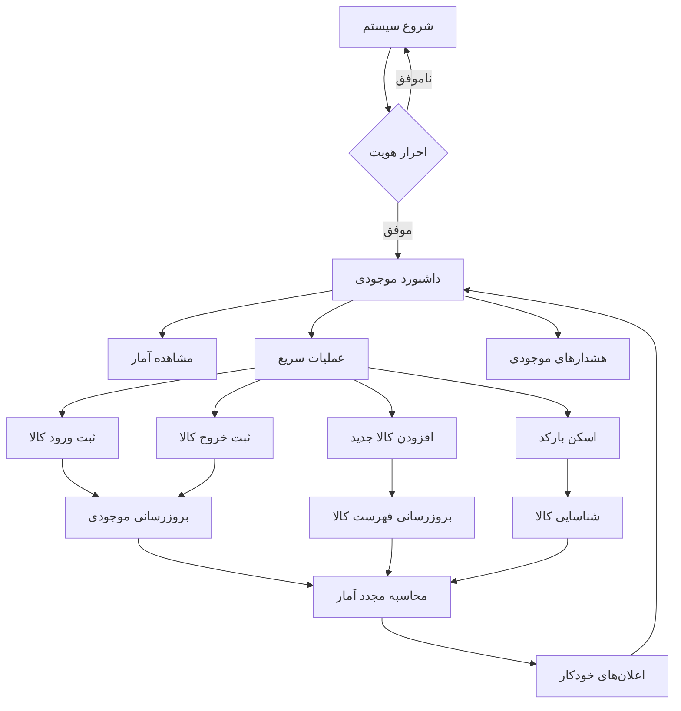
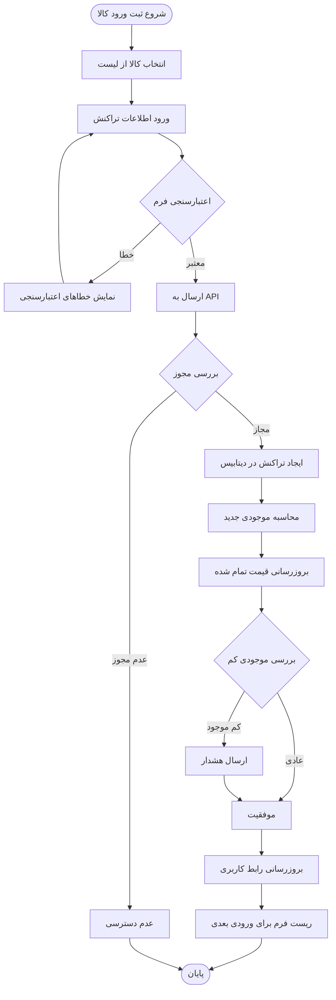
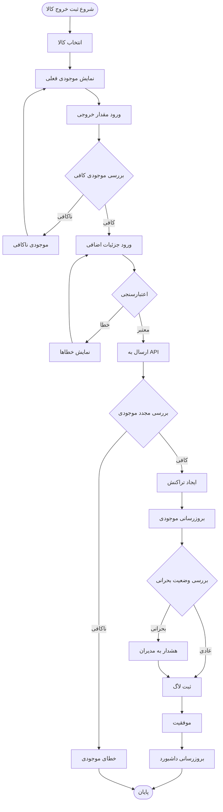
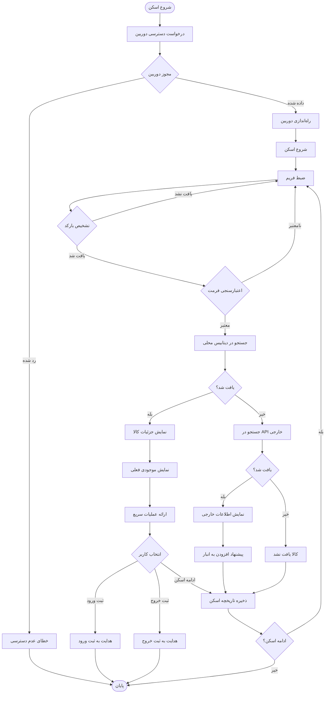
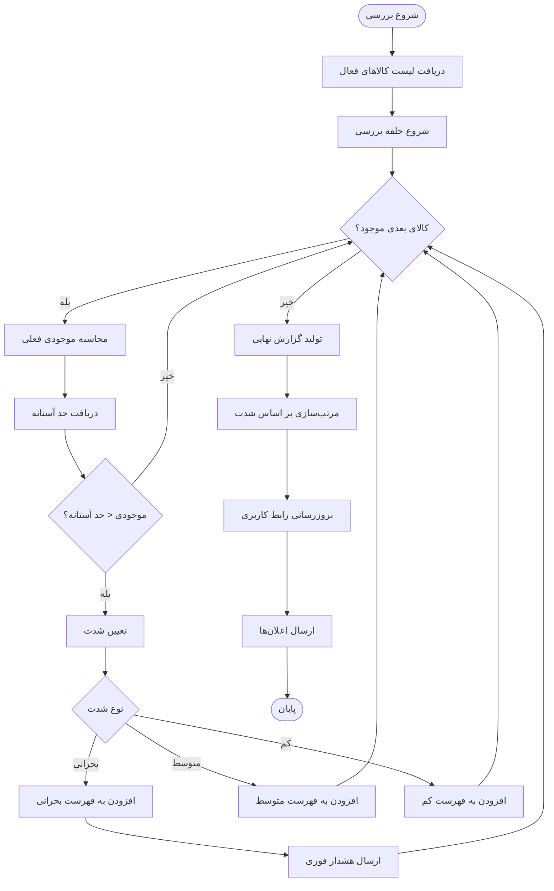
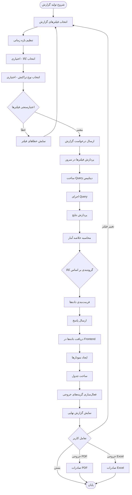
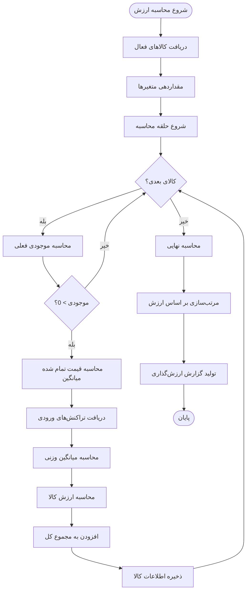
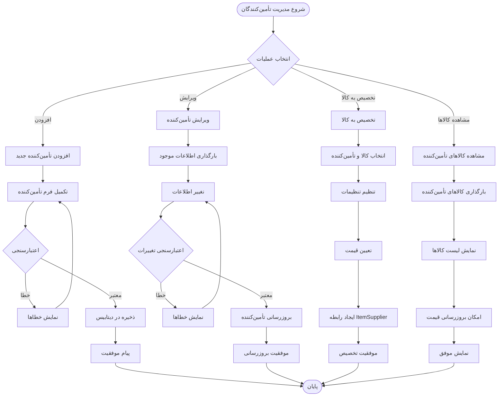
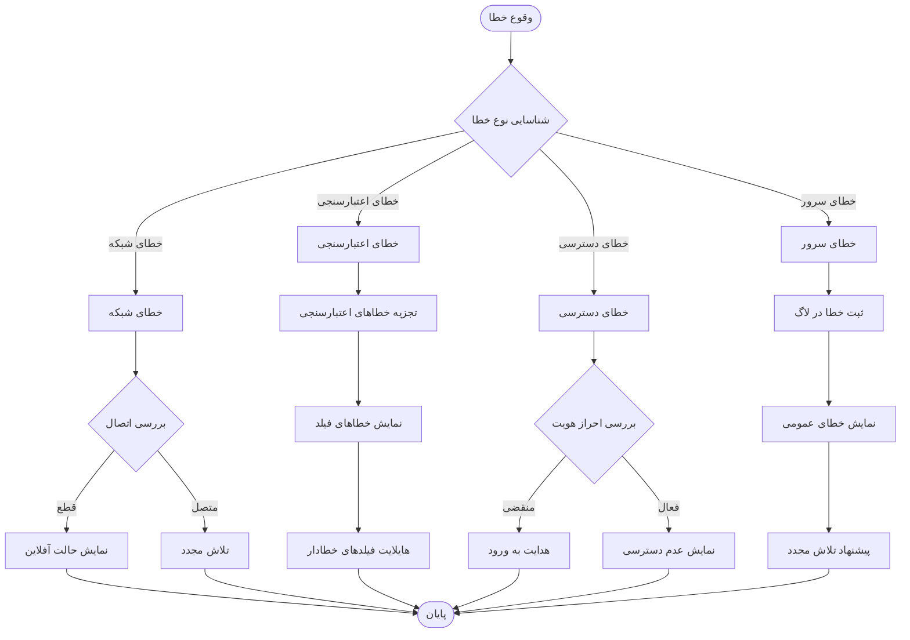
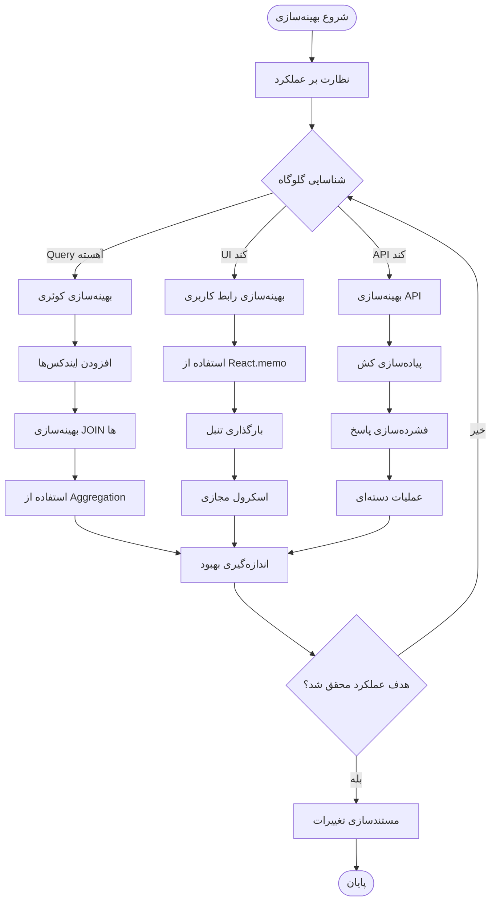

# نمودارهای جریان مدیریت موجودی
# Inventory Management Flowcharts

## نمای کلی نمودارها (Flowcharts Overview)

این سند شامل نمودارهای جریان تصویری برای تمامی فرآیندهای کلیدی مدیریت موجودی است.

## 1. جریان کلی سیستم مدیریت موجودی (Main System Flow)

## 2. جریان ثبت تراکنش ورودی (IN Transaction Flow)

## 3. جریان ثبت تراکنش خروجی (OUT Transaction Flow)

## 4. جریان اسکن بارکد (Barcode Scanning Flow)

## 5. جریان تشخیص موجودی کم (Low Stock Detection Flow)

## 6. جریان تولید گزارش موجودی (Report Generation Flow)

## 7. جریان محاسبه ارزش موجودی (Valuation Calculation Flow)

## 8. جریان مدیریت تأمین‌کنندگان (Supplier Management Flow)

## 9. جریان خطایابی و مدیریت خطا (Error Handling Flow)

## 10. جریان بهینه‌سازی عملکرد (Performance Optimization Flow)

---

> **نکته:** تمامی نمودارهای فوق نمایش تصویری دقیق فرآیندهای پیاده‌سازی شده در سیستم هستند. 